# kolakoski

The [Kolakoski sequence](https://en.wikipedia.org/wiki/Kolakoski_sequence) is an infinite and self-referential sequence that is its own run-length encoding. Inspired by the visualization of this sequence by [Alex Bellos](https://www.alexbellos.com/) in his book as featured on [Numberphile](https://www.youtube.com/watch?v=co5sOgZ3XcM), I made this to generate similar visualizations and even animate them a little.

